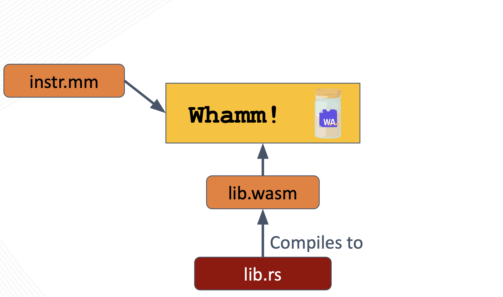

# เริ่มต้นใช้งาน #

ในส่วนนี้คุณจะได้พบข้อมูลเกี่ยวกับวิธีเริ่มต้นเขียน instrumentation ด้วย DSL `Whamm`

# การติดตั้ง #

ปัจจุบัน วิธีติดตั้ง `Whamm` คือการโคลนรีโพสิทอรี บิลด์ซอร์สโค้ดด้วยตนเอง แล้วเพิ่มไบนารีที่บิลด์ได้ลงในตัวแปร `PATH` ของคุณ
ในอนาคต ผู้ใช้จะสามารถดาวน์โหลดไบนารีที่บิลด์ไว้ล่วงหน้าจากหน้า releases บน GitHub ได้ เพราะตอนนี้เรามีรีลีสของ `Whamm` ที่ติดแท็กและเสถียรแล้ว

ขั้นตอนมีดังนี้:
1. โคลน[รีโพ `Whamm`](https://github.com/ejrgilbert/whamm)
2. บิลด์ซอร์สโค้ดด้วย `cargo build --release`
3. เพิ่มไบนารีที่บิลด์ได้ลงใน `PATH` ของคุณ
   ไบนารีนี้ควรอยู่ที่ `target/release/whamm`[1](#why_target)

## การทดสอบเบื้องต้น ##
การทดสอบเบื้องต้นที่คุณสามารถรันเพื่อยืนยันว่าไบนารี `Whamm` อยู่ใน path ของคุณและทำงานได้ตามที่คาดหวัง คือการรันคำสั่ง `whamm --help`
CLI จะแสดงข้อมูลเกี่ยวกับคำสั่งและตัวเลือกต่างๆ ที่พร้อมใช้งานให้คุณ

# มอนิเตอร์และตัวจัดการ Wasm #

อย่างที่กล่าวไว้ใน[บทนำ](../intro.md) `Whamm` ใช้ได้ทั้งเพื่อมอนิเตอร์ **หรือ** ปรับเปลี่ยนการทำงานของโปรแกรม

การ**มอนิเตอร์**การทำงานหมายถึงการ*เก็บข้อมูลบางอย่าง*เกี่ยวกับพฤติกรรมเชิงพลวัตของโปรแกรม
ซึ่งมักนำไปใช้ในการดีบัก การบันทึกล็อก และการเก็บเมตริก

ส่วนการ**ปรับเปลี่ยน**การทำงานหมายถึงการ*เปลี่ยน*พฤติกรรมเชิงพลวัตของโปรแกรมจริงๆ
ลองนึกถึงฟีเจอร์หนึ่งของเครื่องมือดีบักที่เราคุ้นเคยกันดี เมื่อใช้ดีบักเกอร์ นักพัฒนาสามารถตั้งเบรกพอยต์ ตรวจสอบสถานะปัจจุบันของแอปพลิเคชัน และ*เปลี่ยนค่าของตัวแปร*ได้
นี่คือตัวอย่างของการปรับเปลี่ยนพฤติกรรมเชิงพลวัตของแอปพลิเคชันผ่านการเปลี่ยนสถานะ และเป็นสิ่งที่เรามุ่งจะรองรับใน `Whamm`

อ่านเนื้อหาส่วน "เริ่มต้นใช้งาน" ของหนังสือเล่มนี้ต่อไป เพื่อดูวิธีเขียน*มอนิเตอร์*และ*ตัวจัดการ*ในลักษณะดังกล่าว

# โครงสร้างของ Instrumentation ใน `Whamm` #

โครงสร้างหลักของ instrumentation ที่เขียนด้วย `Whamm` ประกอบด้วยสองส่วน คือ สคริปต์ `Whamm` (`instr.mm`) และไลบรารี instrumentation (`instr.wasm`)

ไฟล์ทั้งสองนี้ร่วมกันบอกคอมไพเลอร์ `Whamm` ว่า*จะแทรก* instrumentation *ที่ไหน* และ*จะฉีดตรรกะอะไร* ณ จุดเหล่านั้น

## `instr.mm`  ##
_**ที่ไหน**ที่จะแทรก instrumentation_

สคริปต์ `Whamm` นี้บรรยายหน่วยของ instrumentation โดยระบุจุดที่ต้องการโพรบในแอปพลิเคชันด้วย[ไวยากรณ์โพรบ](./syntax/probes.md)
โดยเนื้อโพรบแต่ละอันจะเก็บตรรกะที่จะฉีด ณ จุดที่แมตช์นั้น
DSL มีความสามารถเพียงพอต่อการรองรับกรณีการใช้งานมอนิเตอร์บางประเภท อย่างไรก็ตาม เพื่อไม่ให้ขอบเขตของ DSL บานปลาย เราจึงตัดสินใจผลักการเขียนโปรแกรมแบบอเนกประสงค์ออกไปยังภาษาใดก็ได้ที่คอมไพล์เป็น Wasm ได้
สคริปต์สามารถเรียกไลบรารี instrumentation ของผู้ใช้ ซึ่งจัดเตรียมไว้ในรูป `lib.wasm`

## `lib.wasm` ##
_**ตรรกะอะไร**ที่จะแทรก ณ จุดเป้าหมายของแอปพลิเคชัน_

การจัดหาไลบรารีนี้ให้ `Whamm` เป็นเรื่อง*ทางเลือก*
จำเป็นเฉพาะเมื่อผู้ใช้ต้องการเขียน instrumentation ด้วยภาษาระดับสูงกว่า หรือเมื่อ DSL ไม่มีไวยากรณ์/เครื่องมือบางอย่างที่จำเป็นต่อตรรกะ instrumentation เท่านั้น
ภาษาดังกล่าว*ต้องคอมไพล์เป็น Wasm ได้* เนื่องจากต้องส่งไลบรารีให้คอมไพเลอร์ `Whamm` ในรูปไฟล์ Wasm

ผู้ใช้ควรคำนึงไว้เสมอว่า ลายเซ็นของฟังก์ชันในไลบรารีที่จะถูกเรียกใช้ภายในเนื้อโพรบ ต้องมีชนิดข้อมูลที่เข้ากันได้กับ[ชนิดข้อมูลที่ `Whamm` ให้ไว้ในปัจจุบัน](./language.md)
มิฉะนั้น `Whamm` จะไม่สามารถคอมไพล์โค้ด instrumentation ของผู้ใช้ได้

# เครื่องมือที่เป็นประโยชน์ #

ต่อไปนี้คือเครื่องมือบางอย่างที่อาจช่วยคุณได้เมื่อทำงานกับ Wasm:
1. [`wabt`](https://github.com/WebAssembly/wabt) หรือที่รู้จักกันในชื่อ WebAssembly Binary Toolkit
2. [`wasm-tools`](https://github.com/bytecodealliance/wasm-tools)

<a name="why_target">1</a>: เราแนะนำให้เพิ่มไบนารีที่บิลด์ภายใน `target/` ลงใน path ของคุณ เพราะจะทำให้คุณดึงการเปลี่ยนแปลงล่าสุดบน `master` มาบิลด์เวอร์ชันใหม่ และมีไบนารีล่าสุดอยู่ใน `PATH` โดยอัตโนมัติ
