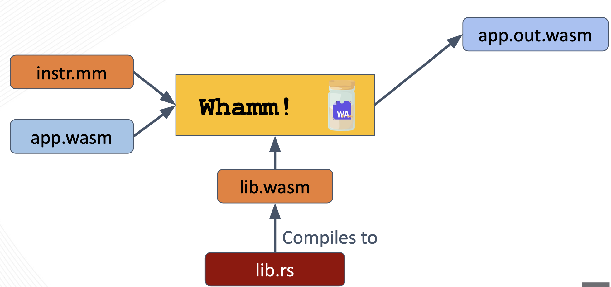
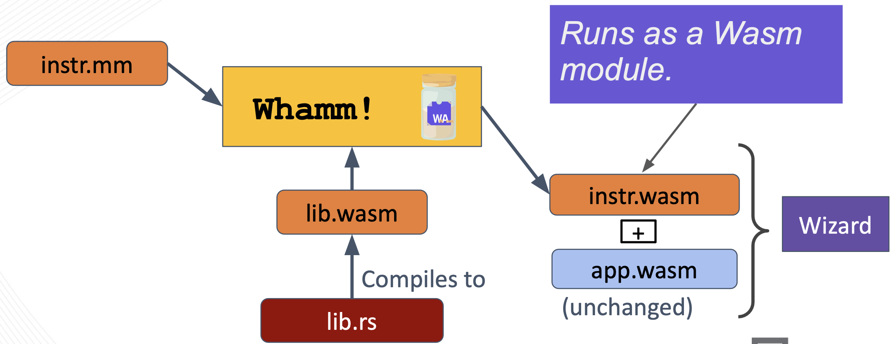

# กลยุทธ์การอินเจกต์ #

การดีบักและโปรไฟล์โปรแกรมเป็นส่วนสำคัญของการวิศวกรรมซอฟต์แวร์
ซึ่งทำได้โดยการทำ instrumentation กับโปรแกรมที่กำลังสังเกตอยู่ (แทรกคำสั่งที่ให้ข้อมูลเชิงลึกเกี่ยวกับการทำงานเชิงพลวัต)

เทคนิค instrumentation ที่พบมากที่สุด เช่น **การเขียนไบต์โค้ดใหม่** จะ_ฉีดคำสั่งเข้าไปในโค้ดของแอปพลิเคชันโดยตรง_
แม้ว่าวิธีนี้จะทำให้ instrumentation รองรับโดเมนของแอปพลิเคชันใดก็ได้ แต่มัน_รุกล้ำ_พื้นที่สถานะของโปรแกรม (อาจทำให้เกิดบั๊ก) ทำให้การนำไปใช้ซับซ้อน จำกัดขอบเขตการสังเกต และไม่สามารถปรับตัวตามพฤติกรรมของโปรแกรมได้แบบพลวัต

อีกทางหนึ่ง เราสามารถแก้ปัญหาเหล่านี้ของการเขียนไบต์โค้ดใหม่ได้ด้วยการ**เชื่อมต่อกับเอนจินรันไทม์**ที่_รองรับ instrumentation โดยตรง_
เทคนิคนี้สามารถนำความสามารถอันทรงพลังมาใช้ได้ ดังที่เอนจินวิจัยอย่าง Wizard สาธิตในเปเปอร์ ASPLOS เรื่อง [Flexible Non-intrusive Dynamic Instrumentation for WebAssembly](https://dl.acm.org/doi/10.1145/3620666.3651338)
เปเปอร์นี้อธิบายวิธีสร้างการรองรับ instrumentation ที่ปกป้องแอปพลิเคชันที่กำลังสังเกต ให้การรับประกันความสอดคล้องเพื่อให้เครื่องมือประกอบกันได้ ใช้การปรับให้เหมาะที่สุดของ JIT เฉพาะกับ instrumentation ซึ่งทำให้เครื่องมือบางตัวรันเร็วกว่าการเขียนไบต์โค้ดใหม่ด้วยซ้ำ และอื่นๆ อีกมาก
อย่างไรก็ตาม เทคนิคนี้ยังไม่เป็นที่นิยมเท่าการเขียนไบต์โค้ดใหม่ เพราะจำกัดขอบเขตของเครื่องมือไว้เฉพาะแอปพลิเคชันที่รันบนเอนจินดังกล่าวได้

นี่คือจุดที่ `Whamm` เข้ามา
DSL นี้เป็นนามธรรมเหนือเทคนิค instrumentation เพื่อให้เครื่องมือของนักพัฒนารองรับแอปพลิเคชันได้หลากหลายโดเมน พร้อมใช้ความสามารถของรันไทม์เท่าที่มี โดยไม่ต้องนำกลับมาเขียนใหม่
ด้วย `Whamm` คุณ_เขียน instrumentation ครั้งเดียว_และ_รองรับแอปได้หลากหลายโดเมน_
_ใช้ความสามารถ instrumentation ของเอนจิน_เท่าที่มี
_ใช้การเขียนไบต์โค้ดใหม่_เพื่อรองรับ_ทุกอย่างที่เหลือ_

## การเขียนไบต์โค้ดใหม่ ##

เมื่อใช้กลยุทธ์นี้ ต้องจัดหาไบต์โค้ดของแอปพลิเคชันเป้าหมายให้คอมไพเลอร์ `Whamm` ด้วย
ในการทำกลยุทธ์การอินเจกต์แบบเขียนไบต์โค้ดใหม่ `Whamm` ใช้ไลบรารี Rust ชื่อ [`wirm`](https://github.com/composablesys/wirm)
ไลบรารีนี้โหลดโมดูล `app.wasm` เข้าเป็นตัวแทน AST ซึ่งท่องไปและปรับแต่งได้ เพื่อฉีด instrumentation เข้าไปในไบต์โค้ดของแอปพลิเคชันโดยตรง
อ่านรายละเอียดระดับต่ำเพิ่มเติมได้ใน[เอกสารสำหรับนักพัฒนา](../devs/intro.md)

แอปพลิเคชันที่ทำ instrumentation แล้วจะถูกส่งออกเป็นโมดูล Wasm ใหม่ ดังที่แสดงด้านบน (`app.out.wasm`)

## การรองรับเอนจินโดยตรง (`wei`)##

ผู้ใช้ยังสามารถกำหนดเป้าหมายเป็นเอนจินที่รองรับ instrumentation โดยตรงผ่านส่วนต่อประสานที่ `Whamm` ใช้ได้
ปัจจุบันมีเอนจิน Wasm เพียงตัวเดียวที่ทำเช่นนี้คือ [Wizard](https://github.com/titzer/wizard-engine)
อ่านเกี่ยวกับความสามารถด้าน instrumentation ของ Wizard ได้ในเปเปอร์ ASPLOS: [Flexible Non-intrusive Dynamic Instrumentation for WebAssembly](https://dl.acm.org/doi/10.1145/3620666.3651338)

คอมไพเลอร์ `Whamm` สร้างโมดูล Wasm ที่เข้ารหัส instrumentation ในแบบทั่วไป โดยไม่ผูกติดกับไบต์โค้ดของแอปพลิเคชันโดยตรง
อ่าน[เอกสารเป้าหมายเอนจิน](../devs/emit/wei.md)ของนักพัฒนาเพื่อดูข้อมูลเพิ่มเติมว่ามันทำงานอย่างไร หากสนใจ

โปรดทราบว่า เมื่อใช้กลยุทธ์นี้ ไบต์โค้ดของแอปพลิเคชันเป้าหมายจะ_ไม่_ถูกจัดหาให้คอมไพเลอร์ `Whamm`
เพราะเอนจินจะเป็นผู้หาจุดฉีด instrumentation ที่เหมาะสมในแอปพลิเคชัน และแนบคอลแบ็กที่เหมาะสมตอน_รันไทม์_ของแอปพลิเคชัน
ดังนั้น `app.wasm` จึงถูกจัดหาเป็น "co-module" (หมายถึงโมดูล Wasm ที่เชื่อมต่อโดยตรงกับ `instr.wasm` ที่สนับสนุนมัน) ให้เอนจินตอนรันไทม์
